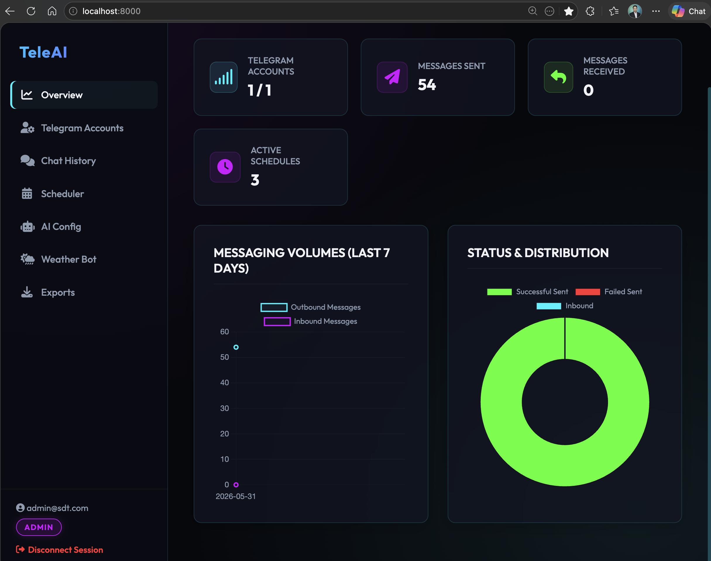
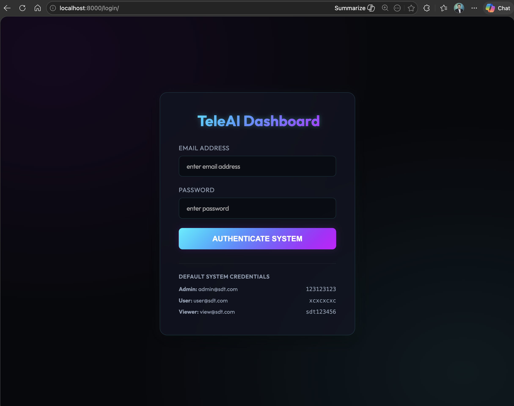
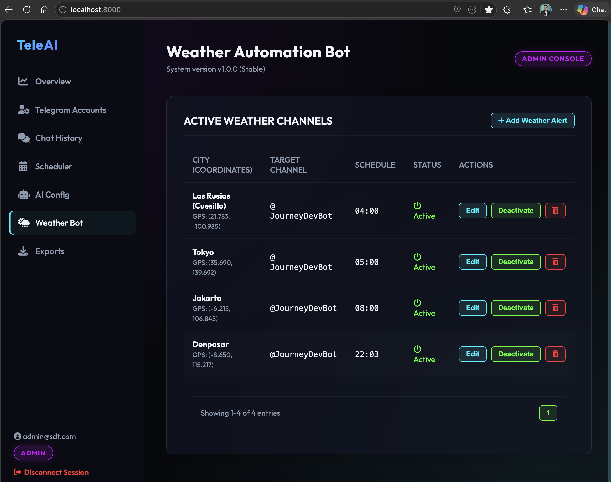
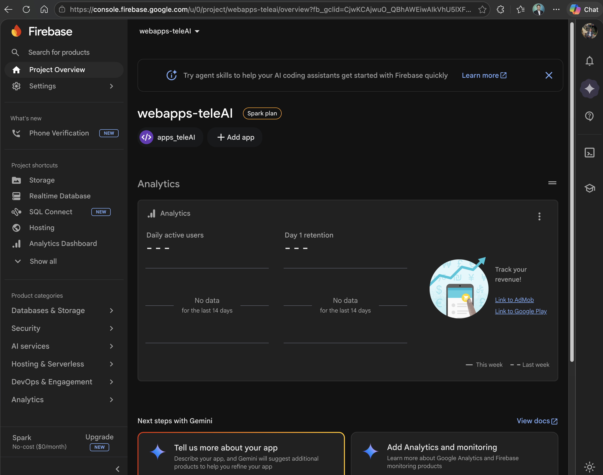

# Django AI Messaging Dashboard with Telegram Integration

A full-featured Django web application for managing Telegram accounts, sending AI-powered messages, scheduling tasks, and analyzing data.



## 🚀 Features

### 🔐 Authentication System
- Django built-in authentication (login/logout dashboard with sidebar neon style ui)
- Multi-user support with roles: Admin, User, Viewer
- Each user manages their own Telegram accounts and data

### 🖥️ Dashboard Features
- **Dashboard**: Overview with stats cards
- **Telegram Accounts**: Manage multiple Telegram API credentials
- **Chat Messages**: View and search chat history
- **Message Scheduler**: Schedule and manage recurring messages
- **Analytics**: Messaging behavior reports
- **AI Assistant**: OpenAI-powered conversation assistant
- **Weather Bot**: Automated weather messaging

### 🗄️ Database
- PostgreSQL with schema `synergydts`
- Redis for caching and Celery tasks
- ClickHouse for analytics

## 📋 User Credentials

| Role | Email | Password |
|------|-------|----------|
| Admin | admin@sdt.com | 123123123 |
| User | user@sdt.com | xcxcxcxc |
| Viewer | view@sdt.com | sdt123456 |

## 🏃 Quick Start

### Database
Postgres 5432
dbname : teleAI
user : postgres
pass : Password09
schema: synergydts
host : localhost

## clickhouse database
host localhost
port 9000
user default
password Password09
db : teleAI
schema : synergydts

#redis
host : localhost
port : 6379
password : 


```
### Git Bash / WSL
```bash
bash run.sh
# or
export PATH="/c/Python314:$PATH"
python manage.py migrate
python manage.py runserver 0.0.0.0:8000
```

Server: http://127.0.0.1:8000/dashboard/

## 🔌 API Endpoints

| Endpoint | Description |
|----------|-------------|
| `/login/` | Authentication |
| `/dashboard/` | Main dashboard |
| `/dashboard/api/stats/` | Dashboard statistics |
| `/api/telegram/accounts/` | Telegram accounts CRUD |
| `/api/messages/logs/` | Chat message history |
| `/api/scheduler/messages/` | Scheduled messages |
| `/api/analytics/metrics/` | Analytics data |
| `/api/ai/configs/` | AI configuration |
| `/api/weather/locations/` | Weather locations |

## ⚙️ Configuration

Copy `.env.example` to `.env` and configure:

```
SECRET_KEY=your-secret-key
DATABASE_NAME=djangoai
DATABASE_USER=postgres
DATABASE_PASSWORD=Password09
TELEGRAM_API_ID=your_api_id
TELEGRAM_API_HASH=your_api_hash
TELEGRAM_BOT_TOKEN=your_bot_token
OPENAI_API_KEY=your-openai-api-key
OPENWEATHER_API_KEY=your-weather-key
SCHEDULER_TZ_OFFSET=7  # Timezone offset for weather scheduler (UTC+7 for WITA)

## 🐳 Docker Deployment

```bash
docker-compose up --build
```

## 📦 Project Structure

django_ai_dashboard/
├── accounts/       # Auth & roles
├── telegram/       # Telethon integration
├── messaging/    # Chat storage
├── scheduler/    # Celery Beat
├── analytics/    # ClickHouse
├── dashboard/    # Frontend UI
├── ai/          # OpenAI assistant
├── weather/      # Weather automation
├── notifications/# Export jobs
└── version/      # App versions

## 📸 Screenshots

| Login | Weather Bot | Firebase |
|-------|-------------|----------|
|  |  |  |